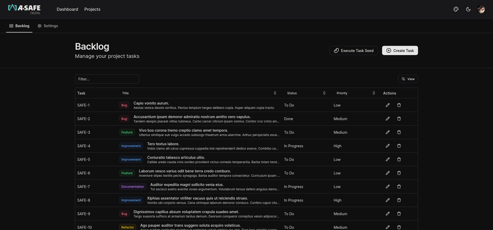
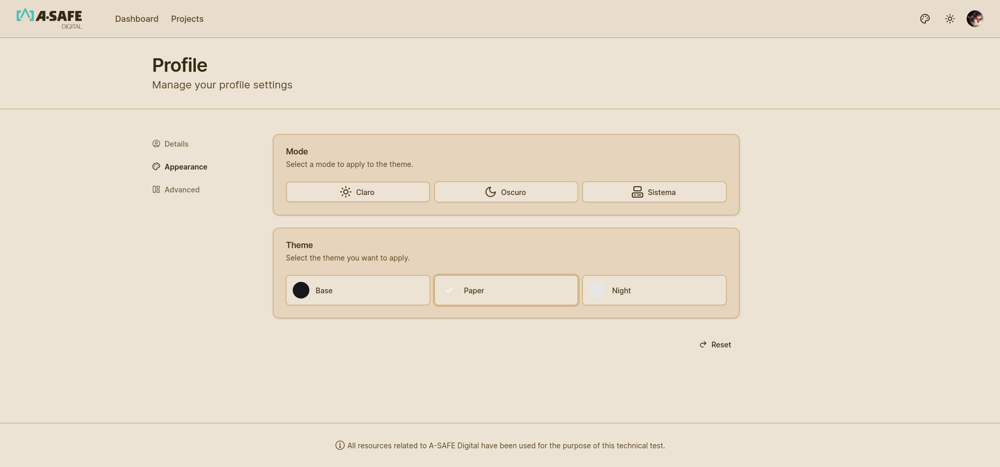
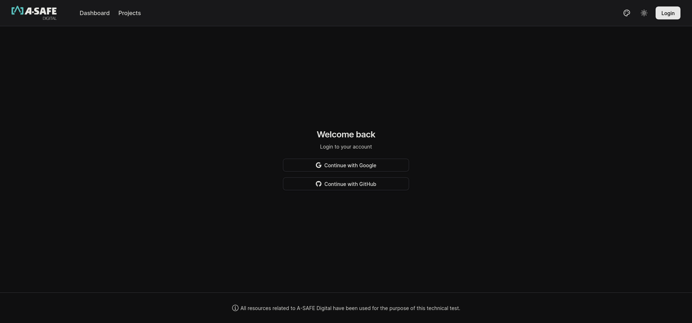
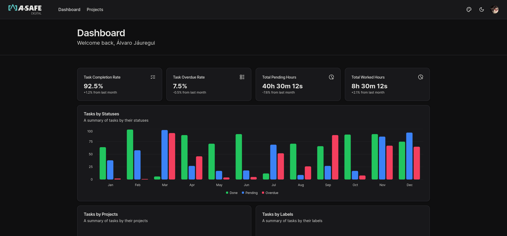
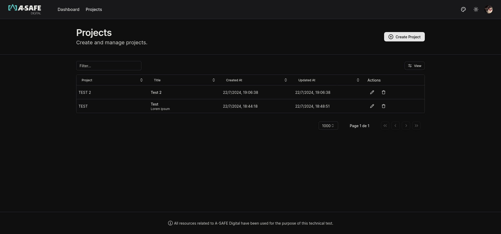
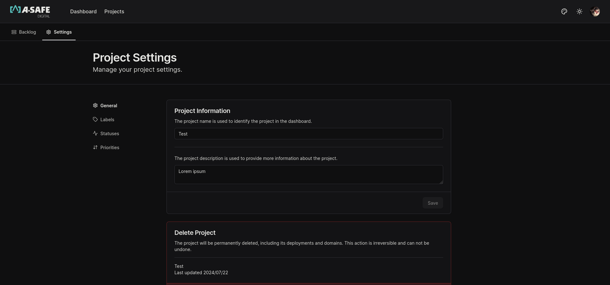
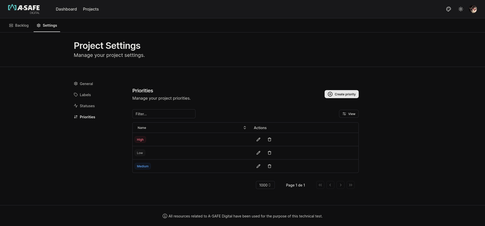

# Technical Test: React Developer with Next.js and Tailwind CSS


## Table of Contents

-   [Introduction](#introduction)
-   [Project Structure](#project-structure)
-   [Getting Started](#getting-started)
-   [Environment Variables](#environment-variables)
-   [Scripts](#scripts)
-   [Technologies](#technologies)
-   [Deployment](#deployment)
-   [Usage](#usage)
-   [Author](#author)

## Introduction

Technical test for the React Developer position with Next.js and Tailwind CSS at [**A-SAFE Digital**](https://asafedigital.com/).

Since the technical test did not specify the application’s data model requirements, I decided to use Prisma for database management. The database contains the following models:

NextAuth:

-   User
-   Account
-   Session
-   VerificationToken

Project manager app:

-   Project
-   ProjectStatus
-   ProjectMember
-   Task
-   TaskStatus
-   TaskPriority
-   TaskLabel

The application includes the following functionalities:

-   Authentication with NextAuth.
-   Project creation.
-   Task creation.



````bash

## Project Structure

```bash
├── prisma
│   ├── schema.prisma
├── public
│   ├── favicon.ico
├── src
│   ├── app
│   │   ├── (auth)
│   │   ├── api
│   │   ├── dashboard
│   │   ├── profile
│   │   ├── layout.tsx
│   │   ├── page.tsx
│   ├── components
│   │   ├── auth
│   │   ├── layout
│   │   ├── modules
│   │   ├── ui
│   ├── config
│   │   ├── dashboard.ts
│   │   ├── query.ts
│   │   ├── site.ts
│   ├── data
│   │   ├── seed.ts
│   ├── hooks
│   │   ├── use-media-query.ts
│   ├── lib
│   │   ├── actions
│   │   ├── queries
│   │   ├── schemas
│   ├── providers
│   │   ├── custom-theme-provider.tsx
│   │   ├── query-provider.tsx
│   │   ├── theme-provider.tsx
│   ├── styles
│   │   ├── global.css
│   │   ├── themes.css
│   ├── types
│   ├── env.mjs
│   ├── middleware.ts
````

I chose this architecture for its simplicity, ease of understanding, scalability, and maintainability. Below is a detailed explanation of each directory's purpose:

### app

This directory contains the main application components, divided into subdirectories based on functionality. The `api` directory within contains NextAuth handlers and routes for data fetching.

Note: The purpose of the API is to enable Next.js tag revalidation.

### components

This directory houses reusable components. The `modules` directory contains components used for data representation, while the `ui` directory contains user interface components.

### config

This directory contains configuration files.

### data

This directory contains seed data used for generating statistics for the dashboard. Run the following command to generate the data:

```bash
npx ts-node data/seed.ts
```

### hooks

This directory contains custom hooks.

### lib

This directory contains business logic.

### providers

This directory contains context providers. Notably, `query-provider.tsx` implements a simple context for handling application queries and local storage data persistence. While Next.js caching makes this context optional, it fulfills a technical test requirement. Additionally, `custom-theme-provider.tsx` manages the application's theme context, allowing theme changes.

### styles

This directory contains global styles. `global.css` includes the application's global styles, while `themes.css` contains theme definitions.

### types

This directory contains TypeScript types.

### env.mjs

This file contains type definitions for environment variables. I prefer using this file to define environment variables. :)

### middleware.ts

This file contains middleware functions, including the NextAuth authentication middleware used to protect application routes.

## Getting Started

### Option 1: Without Docker

First, clone the repository and install the dependencies:

```bash
git clone
cd technical-test-react
npm install
```

Then, start the application with:

```bash
npm run dev
```

### Option 2: With Docker

First, clone the repository:

```bash
git clone
cd technical-test-react
```

Then, build the Docker image:

```bash
docker compose -f docker-compose-dev.yml up --build
```

Next, create the Prisma schema:

```bash
docker compose -f docker-compose-dev.yml exec app npx prisma generate
```

Then, run the Prisma migration:

```bash
docker compose -f docker-compose-dev.yml exec app npx prisma migrate dev
```

The application will be available at [http://localhost:3000](http://localhost:3000).

## Environment Variables

Environment variables are in the `.env.example` file. To set up environment variables, create a `.env.local` file in the project's root directory and copy the contents of `.env.example` into `.env.local`. Then, configure the environment variables in `.env.local`.

## Scripts

-   `dev`: Starts the application in development mode.
-   `build`: Builds the application for production.
-   `start`: Starts the application in production mode.
-   `lint`: Lints the project files.
-   `prettier`: Formats the project files.
-   `prettier:check`: Checks if the project files are formatted correctly.
-   `tsc:check`: Checks for TypeScript errors in the project.
-   `test:unit`: Runs unit tests.
-   `cypress:open`: Opens Cypress.
-   `cypress:run`: Runs Cypress.
-   `prisma:generate`: Generates Prisma files.
-   `prisma:migrate`: Migrates the database.
-   `prisma:studio`: Starts Prisma Studio.

## Technologies

-   [Next.js](https://nextjs.org/)
-   [Tailwind CSS](https://tailwindcss.com/)
-   [Prisma](https://www.prisma.io/)
-   [TanStack Table](https://tanstack.com)
-   [NextAuth](https://next-auth.js.org/)
-   [Recharts](https://recharts.org/)
-   [React Hook Form](https://react-hook-form.com/)
-   [Radix](https://www.radix-ui.com/)

## Deployment

The application can be deployed on your preferred hosting platform, such as Vercel, Netlify, AWS, etc. A `Dockerfile` is available for creating a Docker image, and a `docker-compose.yml` file for creating a Docker container.

I personally deployed the application on my own server using Nginx as the web server and PM2 as the process manager, with Let's Encrypt for SSL configuration.

## Usage

To use the application, first register. Then, you can create projects and tasks. The application includes a dashboard displaying project and task statistics.

### Theme

You can change the application theme on the profile page or from the dashboard.



### Authentication

The application uses NextAuth for authentication. You can register with GitHub or Google.



### Dashboard

The dashboard displays project and task statistics generated from the data in `data/seed.ts`.



### Projects

You can create projects.



### Tasks

You can create tasks. Use the "Create Task" button or the "Execute Task Seed" button to generate tasks automatically.


### Project settings

You can change the project's name and description, delete the project, and add labels, statuses, and priorities to tasks.





## Author

-   [Álvaro Jáuregui Pinto](https://illodev.com/)

## Final Notes:

I would have liked to test the application with Cypress, but I didn't have enough time to do so. Still, I hope the application meets the technical test requirements. Thanks for the opportunity! 🚀
